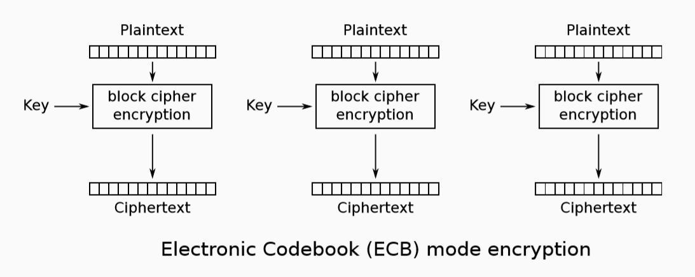
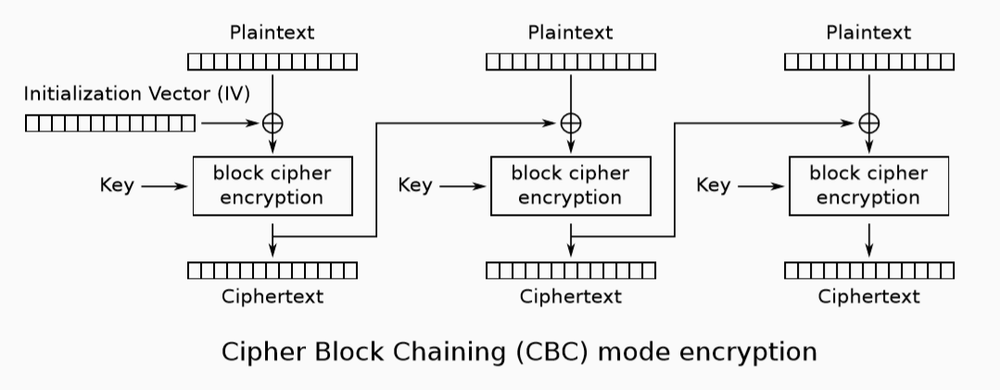
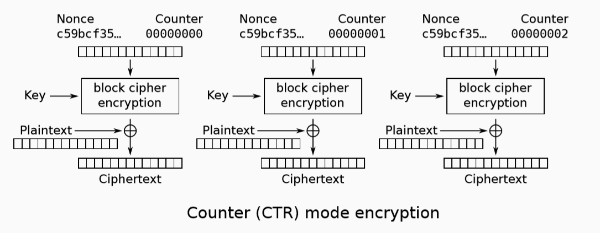
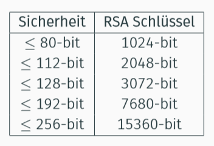
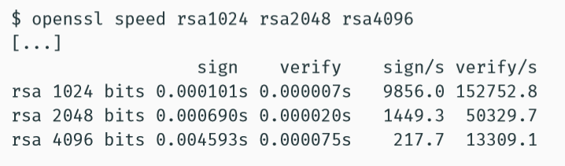
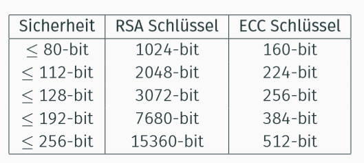
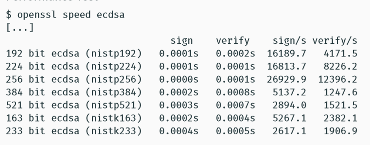

## Schutzziele

* **Vertraulichkeit (confidentially)**
  * Kein Zugriff auf System/Daten ohne Erlaubnis
* **Integrität (integrity)**
  * Änderungen am System/Daten ohne Erlaubnis nicht möglich
* **Verfügbarkeit (availability)**
  * Ordnungsgemäßer Zugriff auf System/Daten kann nicht behindert werden
* **Authentizität (authenticity)**
  * Daten/Objekt stammt tatsächlich von einer spezifischen Identität
* **Verbindlichkeit (non-repudiation)**
  * Durchführung einer Aktion mit einer spezifischen Identität kann im Nachhinein nicht abgestritten werden

## Symmetrische Kryptographie

### Data Encryption Standard (DES)

* Schlüssellänge: 56-bit (+8 Paritätsbits)
* Blockgröße: 64-Bit
* Basiert auf einem Feistel-Netzwerk mit 16 Runden

### Triple DES (3DES)

* Schlüssellänge: 3*56 = 168-bit
* Einschätzung durch NIST: 80-bit Sicherheit
* DES wird auf jeden Block dreifach angewendet (K1, K2, K3)

### Advanced Encryption Standard (AES)

* Blockgröße: 128-bit
* Schlüssel: 128-bit (10 Runden), 192-bit (12 R.), 256-bit (14 R.)
* Basiert auf einem Substitutions-Permutations-Netzwerk

#### ECB Modus

#### CBC Modus

Blöcke müssen sequentiell ver- und entschlüsselt werden.

#### CTR Modus

Blöcke können parallel ver- und entschlüsselt werden.

## Asymmetrische Kryptographie

### RSA

* Erstes asymmetrisches Verschlüsselungsverfahren
* Erstes Verfahren für digitale Signaturen
* Basiert auf Faktorisierungsproblem
* Immer noch weit verbreiteter Einsatz
* **Hauptsächliche Einsatzzwecke**
  * Verschlüsselung kleiner Datenmengen, z.B. Schlüssel
  * Digitale Signaturen, z.B. E-Mails oder Zertifikate

#### Schlüssellängen und Sicherheitslevel

#### Performance

### Elliptic Curve Cryptography (ECC)

#### Schlüssellängen und Sicherheitslevel

ECC Sicherheit = (ECC Schlüssel) / 2

#### Performance

